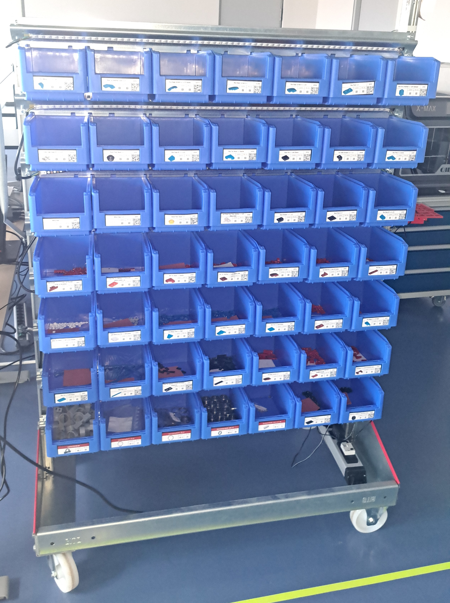
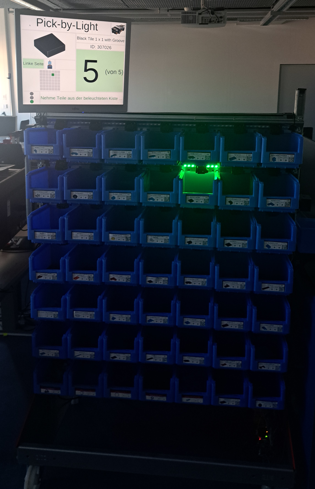
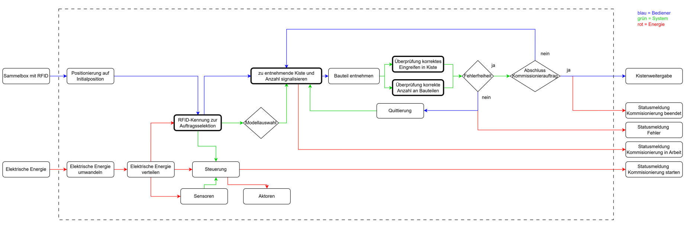
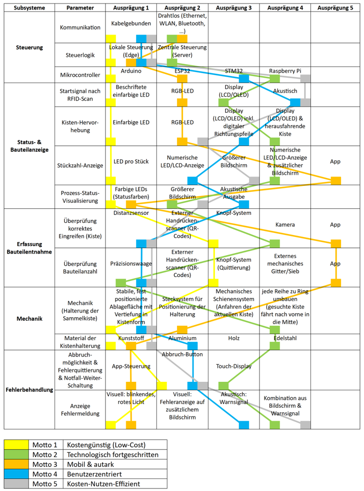
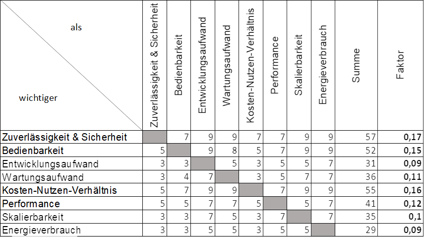
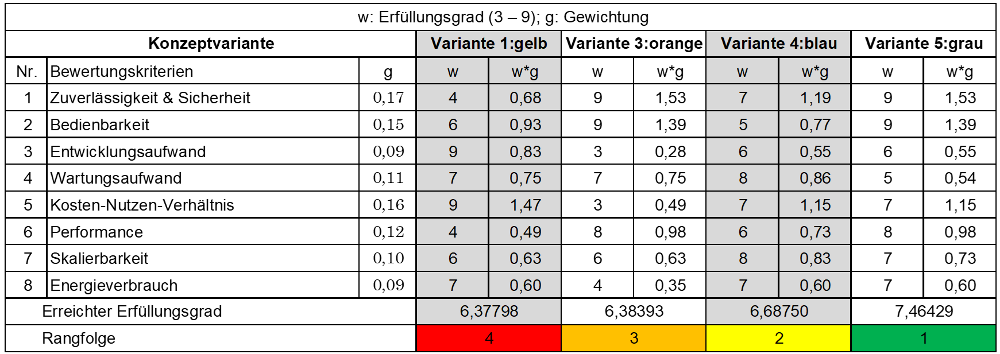
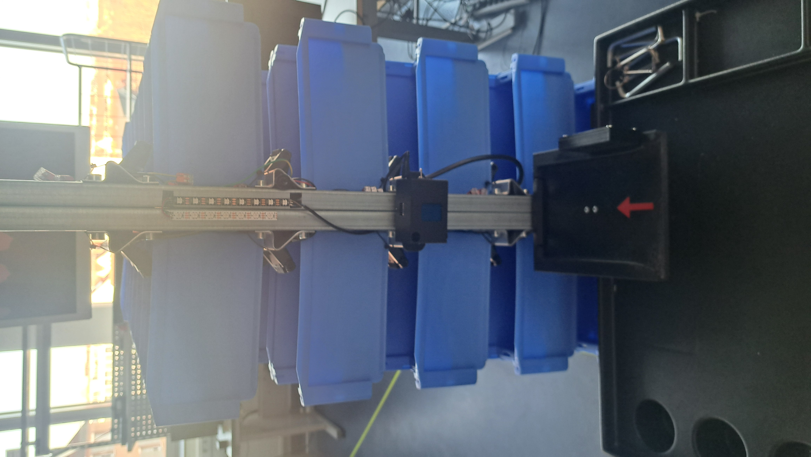
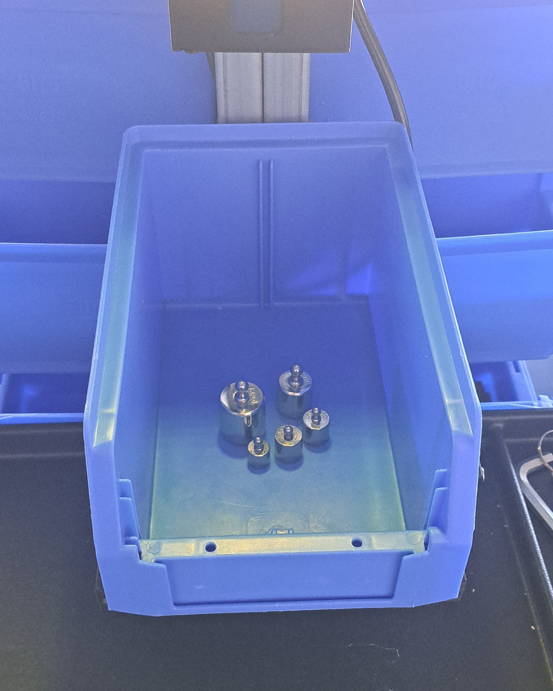
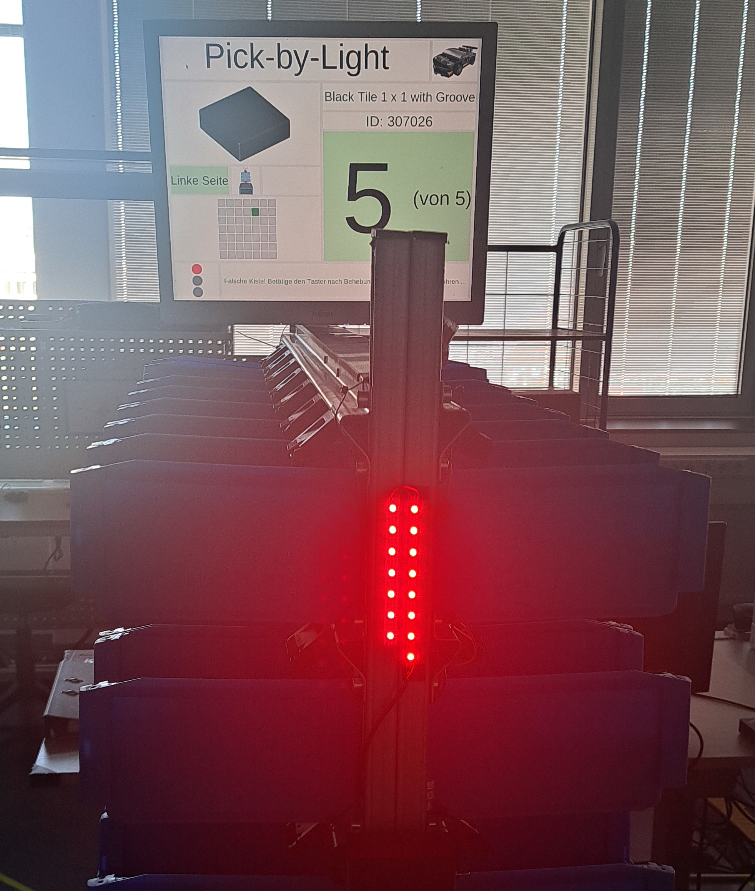
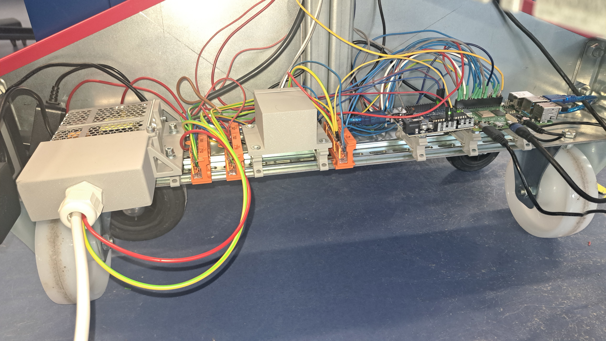

# Entwicklung eines Pick-by-Light-Systems zur Effizienzsteigerung in der Kommissionierung

## Projektbeschreibung

Im Rahmen dieser Projektarbeit wurde ein bestehendes Pick-by-Light-System in der Lernfabrik (KA.409) der Technischen Hochschule Nürnberg erneuert und erweitert. Ziel war die Effizienzsteigerung im Kommissionierprozess durch eine automatisierte Auftragsselektion, Eingriffsüberwachung und Stückzahlüberprüfung. Das System wurde auf Basis eines Raspberry Pi 4B und eines Arduino Uno realisiert und ist vollständig in Python (Raspberry Pi) bzw. C++ (Arduino) implementiert.

| VORHER | NACHHER |
| :---: | :---: |
|  |  |

**Kernkomponenten:**

- **RFID-basierte Auftragsselektion** – Automatische Erkennung der eingeführten Kiste
- **Infrarot-Eingriffsüberwachung** – Erkennung von Entnahmen aus den Kisten
- **Wägezelle zur Stückzahlüberprüfung** – Gewichtsbasierte Kontrolle der entnommenen Teile
- **LED-Streifen & Monitor (HMI)** – Visuelle Führung des Kommissionierers

## Konzeptionierung inkl. Bewertung

Die Konzeptionierung orientierte sich am mechatronischen V-Modell. In einem ersten Schritt wurden auf Basis einer Swimlane-Funktionsstruktur die Teilfunktionen des Systems identifiziert.

### Anforderungsliste

Die Anforderungsliste definiert die funktionalen und nicht-funktionalen Anforderungen an das System, z. B. Fehlerraten der Sensorik (< 0,5 %), Kostenziel (300 €), maximales Gesamtgewicht (< 200 kg) und Einarbeitungszeit.

### Morphologischer Kasten

Für jede Teilfunktion wurden im morphologischen Kasten mehrere technische Lösungsvarianten gegenübergestellt – darunter verschiedene Identifikationsverfahren (RFID, Barcode, QR-Code), Sensorprinzipien zur Eingriffsüberwachung (Infrarot, Ultraschall, Laser) und Möglichkeiten zur Stückzahlprüfung (Waage, Kamera, manuell).

### Paarweiser Vergleich

Über einen konsolidierten paarweisen Vergleich wurde die Gewichtung der einzelnen Anforderungen bestimmt. Drei Personen haben unabhängig voneinander bewertet, um eine möglichst objektive Priorisierung zu erreichen.

### Nutzwertanalyse

Auf Basis des paarweisen Vergleichs wurde eine Nutzwertanalyse durchgeführt, um die beste Gesamtlösung aus den Varianten des morphologischen Kastens zu ermitteln. Das gewählte Konzept kombiniert RFID für die Auftragsselektion, Infrarot-Module für die Eingriffsüberwachung und eine Wägezelle für die Stückzahlüberprüfung.

## Umsetzung

### Kommissionierungsauswahl – RFID

Jede Kiste besitzt einen RFID-Transponder, der beim Einschieben in die Halterung vom RFID-Modul (RC522) über SPI ausgelesen wird. Anhand der UID wird der zugehörige Kommissionierauftrag aus einer Excel-Datenbank geladen. Das RFID-Lesegerät ist in einem 3D-gedruckten Gehäuse in die Kistenhalterung integriert, um einen zuverlässigen Leseabstand zum Transponder sicherzustellen.

### Eingriffsüberprüfung – Infrarot

Vor jeder Kiste sitzt ein Infrarot-Modul bestehend aus einer IR-Diode (Sender) und einem IR-Empfänger (TSSP4P38, 38 kHz Trägerfrequenz). Die Dioden werden über eine MOSFET-Schaltung mit einem gepulsten 5 V-Signal angesteuert. Die IR-Empfänger werden über MCP23017-I/O-Expander per I2C am Raspberry Pi ausgelesen. Beim Eingriff in eine Kiste wird der IR-Strahl frühzeitig reflektiert und der Eingriff aufgrund erhöhter Signalstärke erkannt. Die Module sind in 3D-gedruckten Gehäusen mit einstellbarem Sendewinkel verbaut. Beim Systemstart erfolgt eine automatische Kalibrierung jedes Moduls.

### Stückzahlüberprüfung – Waage

Eine 1 kg-Wägezelle mit HX711-ADC wird über den Arduino Uno ausgelesen, da der Raspberry Pi aufgrund seines Betriebssystem-Timings keine stabilen Messwerte liefern konnte. Die Kommunikation zwischen Arduino und Raspberry Pi erfolgt über die serielle USB-Schnittstelle. Das System erkennt Gewichtssprünge und berechnet über das bekannte Einzelgewicht der Bauteile die Anzahl der entnommenen Teile. Die Kalibrierung der Waage kann über einen langen Taster-Druck gestartet werden und nutzt ein 200 g-Referenzgewicht. Der Kalibrierungswert wird im EEPROM des Arduino gespeichert.

Die Wägezelle ist als zentrales Verbindungselement zwischen Trägergestell und Kistenaufnahme montiert, wobei die einseitige Befestigung die elastische Verformung für das Messprinzip gewährleistet.

### Signalisierung zu entnehmende Kiste und Anzahl der zu entnehmenden Teile

#### LED-Strip

Zwei WS2812B-LED-Streifen signalisieren dem Kommissionierer die aktuell zu entnehmende Kiste (grün leuchtend). Die Ansteuerung erfolgt über den Raspberry Pi, wobei ein SN74AHCT125N Level-Shifter die 3,3 V-Signale auf die benötigten 5 V anhebt.

#### HMI

Die grafische Oberfläche läuft als Tkinter-Anwendung auf dem Raspberry Pi und zeigt auf einem Monitor den aktuellen Kommissionierstatus, die zu entnehmende Stückzahl und Fehlermeldungen an. Da die GUI-Mainloop und die Sensorauswertung parallel laufen müssen, wurde die Architektur auf drei Prozesse (Multiprocessing) aufgeteilt:

1. **GUI-Prozess** – Aktualisierung der Anzeige
2. **Messschleife** – Auslesung der IR-Module über I2C
3. **Wägezellen-Prozess** – Auslesen der Gewichtswerte über den Arduino

Die Kommunikation zwischen den Prozessen erfolgt über Queues.

### Systemintegration und Realisierung

- **Controller:** Raspberry Pi 4B (Hauptcontroller) + Arduino Uno (Waage + IR-Pulssteuerung)
- **Hutschiene:** Alle Elektronikbauteile sind modular über DIN-Schiene montiert
- **Schaltnetzteil:** 50 W / 10 A Netzteil für die IR-Dioden, in einem Schutzgehäuse verbaut
- **MOSFET-Schaltung:** IRLZ44N (N-Kanal) + IXTP96P085T (P-Kanal) zur Erzeugung des 38 kHz-Pulssignals auf einer Lochrasterplatine
- **Taster:** Interrupt-basierte Auswertung am GPIO26 mit Unterscheidung zwischen kurzem Druck (Weiterschalten), langem Druck (Kalibrierung / Zurückschalten) und Doppeldruck (Abbruch)
- **Kistenhalterung:** 3D-gedruckte Führung mit Nut-Feder-Prinzip für reproduzierbare Positionierung der Kiste und integriertem Kabelkanal
- **Autostart:** Das Programm startet automatisch nach dem Hochfahren des Raspberry Pi

## Validierung und Tests

Die Validierung erfolgte anhand der definierten Anforderungsliste. Die meisten funktionalen Anforderungen konnten bestätigt werden, einige Punkte waren zum Testzeitpunkt nicht prüfbar (z. B. Gesamtgewicht, Energieverbrauch, Einarbeitungszeit).

| Teilsystem | Fehlerrate (gemessen) | Fehlerrate (Soll) | Ergebnis |
|---|---|---|---|
| **RFID-Erkennung** | 0 % (30 Versuche) | < 0,5 % | ✅ Erfüllt |
| **Eingriffsüberwachung** | 12,5 % (14 Kisten × 20 Zyklen) | < 0,5 % | ❌ Nicht erfüllt |
| **Stückzahlüberprüfung** | 22,5 % (4 Teile × 3 Mengen × 10 Zyklen) | < 0,5 % | ❌ Nicht erfüllt |

Die Eingriffsüberwachung ist stark abhängig von der Geschwindigkeit des Bedieners – langsame Eingriffe werden zuverlässig erkannt, schnelle nicht immer. Das Kostenziel von 300 € wurde mit ca. 500 € überschritten, hauptsächlich durch Leitungen und Verbindungselemente.

## Verbesserungsmöglichkeiten

- **Infrarot-Sensorik:** Kürzere Sende-/Pausenzeiten (< 120 ms / < 380 ms) und angepasster Duty Cycle könnten schnelle Eingriffe besser erkennen. Alternative Kalibrierungsverfahren (Median statt Mittelwert) wären ebenfalls vielversprechend.
- **LED-Streifen:** Austausch des fragilen Systems empfohlen; einheitliche Farbcodierung und Stützkondensator am Level-Shifter nachrüsten.
- **Waage:** Bedingung einbauen, dass vor Waagenauswertung ein korrekter IR-Eingriff erkannt sein muss. Negative Sprünge als Fehlermeldung auswerten.
- **RFID:** Beschreibung der Tags mit Daten statt UID-Zuordnung im Code, um neue Kisten ohne Programmänderung einbinden zu können.
- **Verkabelung:** Farbcodierung vereinheitlichen (aktuell teils grün-gelb als GND statt normgerecht als PE). Alternative Kommunikationswege (z. B. Bluetooth) zur Reduzierung der Leitungsintensität prüfen.
- **Software:** Tonausgabe bei Fehlern über USB-Soundkarte, schönere GUI, LED-Zuordnung austauschfreundlicher gestalten.

## Fazit und Ausblick

Das Pick-by-Light-System wurde erfolgreich als funktionsfähiger Prototyp umgesetzt. Die Auftragsselektion per RFID funktioniert zuverlässig (0 % Fehlerrate). Die Eingriffsüberwachung und Stückzahlüberprüfung zeigen grundsätzliche Funktionsfähigkeit, erreichen die geforderten Fehlerraten aber noch nicht. Insbesondere die Abhängigkeit der IR-Erkennung von der Eingriffgeschwindigkeit und die Drift der Wägezellenwerte stellen Herausforderungen dar, die durch die vorgeschlagenen Optimierungen adressiert werden können.

Das System bietet eine solide Grundlage für zukünftige Weiterentwicklungen im Rahmen der Lernfabrik.
